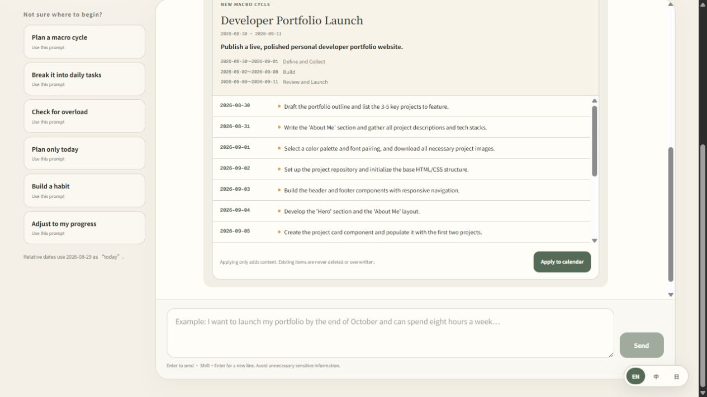

<div align="center">

# Daybook

### Turn a distant goal into one small step for today.

An AI-assisted calendar for planning macro cycles, building daily habits, and learning from reflection.

[Live app](https://calendar.matthiola.dev/) · [AI planner guide](docs/ai-planner.md) · [Report a vulnerability](SECURITY.md)

[English](README.md) | [繁體中文](docs/README.zh-TW.md) | [日本語](docs/README.ja.md)

</div>



## Why Daybook?

Most task lists begin with *what should I do today?* Daybook begins one level higher: *what am I trying to change, and what is the smallest useful action now?*

Set a time-bounded macro cycle, describe the outcome, divide it into phases, and connect each daily task to the larger direction. The built-in AI planner can read the relevant dates, respect existing commitments, and prepare a proposal for review. Nothing is written until you approve it.

## What makes it different

| From intention | To daily action | To learning |
| --- | --- | --- |
| Macro cycles with outcomes, phases, dates, and a completion reward | AI-generated tasks, recurring schedules, day sections, and two-minute starts | Progress bars, streaks, activity notes, reflections, and custom records |

- **AI planning with a safety step** — converse in English, Traditional Chinese, or Japanese; preview the proposed cycle and tasks before applying them.
- **Macro and daily cycles** — link small tasks to a goal or phase and watch the macro-cycle progress update automatically.
- **A day you can shape** — divide each day into focused sections, then drag tasks into place or assign them on mobile.
- **Useful repetition** — repeat by day, week, or month; stop after a count or on a date; edit one occurrence or the whole series.
- **Habit-friendly details** — add the identity you are building, the cue that starts the action, and a two-minute version for difficult days.
- **A record beyond checkboxes** — capture what happened, write a reflection, and create reusable fields such as LeetCode notes.
- **Private accounts and device sync** — use Google or a username and password. Each account has isolated calendar data that follows it across devices.
- **Agent-ready** — a local CLI lets an authorized coding agent read and update the same calendar without direct database access.

## Inspired by *Atomic Habits*

Daybook turns several ideas from James Clear's habit framework into practical planning controls:

- define the identity behind a habit, not only its outcome;
- make the starting cue explicit;
- reduce resistance with a two-minute first action;
- make progress visible and recover quickly after a missed occurrence.

Read the official [Atomic Habits summary](https://jamesclear.com/atomic-habits-summary) or [book introduction](https://jamesclear.com/atomic-habits). Daybook is an independent open-source project and is not affiliated with James Clear.

## AI planner

Ask Daybook to create a macro cycle, break an active phase into daily work, check for overload, design a habit, or adjust the next two weeks to match real progress.

The planner follows a deliberate review flow:

1. It selects only the date range needed for the request.
2. The server loads existing tasks, cycles, phases, and day sections in that range.
3. The model returns a structured proposal instead of writing directly to the database.
4. Daybook validates dates, limits, links, and duplicates.
5. You inspect the proposal and choose whether to apply it.

Applying a proposal only adds content; it does not delete or overwrite existing calendar items. See the [AI planner guide](docs/ai-planner.md) for configuration, limits, data flow, and prompt examples.

## Quick start

Requirements: Node.js 22.13 or newer.

```bash
git clone https://github.com/matthiola0/my-calendar.git
cd my-calendar
npm install
cp .env.example .env.local
npm run dev
```

Configure `PASSWORD_PEPPER` with at least 32 random characters for username/password authentication. Google OAuth and the web AI planner are optional; the planner requires a server-side `GROQ_API_KEY`. Never commit `.env` files.

Validate a change before opening a pull request:

```bash
npm run lint
npm run build
npm run db:generate # only after changing db/schema.ts
```

## Project map

```text
app/components  UI and client interactions
app/lib         authentication, i18n, calendar, and LLM planning logic
app/api         authenticated server routes
db              D1 schema and migrations
docs            focused project documentation
scripts         local calendar agent CLI
```

The application uses React and Next.js-compatible routing through vinext, Drizzle ORM with Cloudflare D1, and a Groq-compatible structured-output planner.

## Local agent access

The project CLI operates as the authenticated owner configured in the local environment. It can read dates before planning, preserve existing items, add linked tasks, and verify the result afterward.

```bash
npm run calendar -- get 2026-09-01
npm run calendar -- add 2026-09-01 "Draft the project outline"
npm run calendar -- cycles
```

The complete command contract is in [AGENTS.md](AGENTS.md). Calendar content is private data; do not print it in public logs, issues, screenshots, or commits.

## Contributing

Issues and pull requests are welcome. Keep changes focused, preserve account isolation, and include the relevant lint/build or manual verification result. For security problems, use the private process in [SECURITY.md](SECURITY.md) instead of a public issue.
